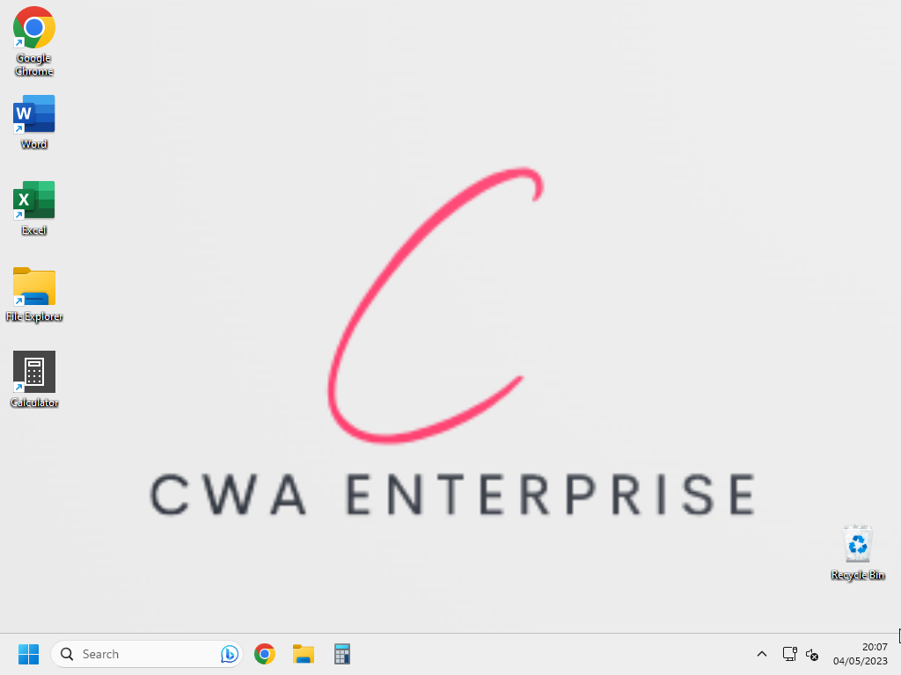
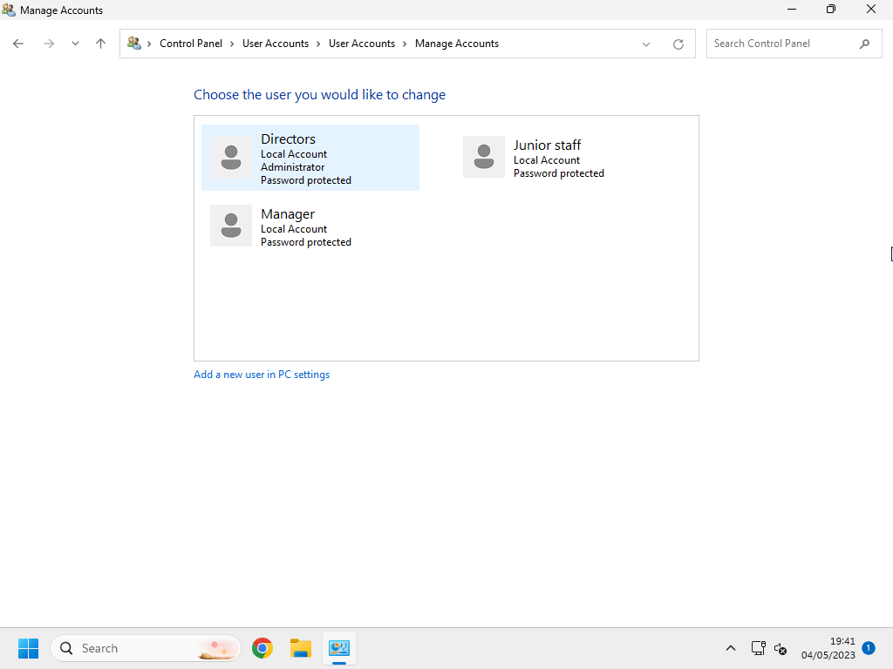
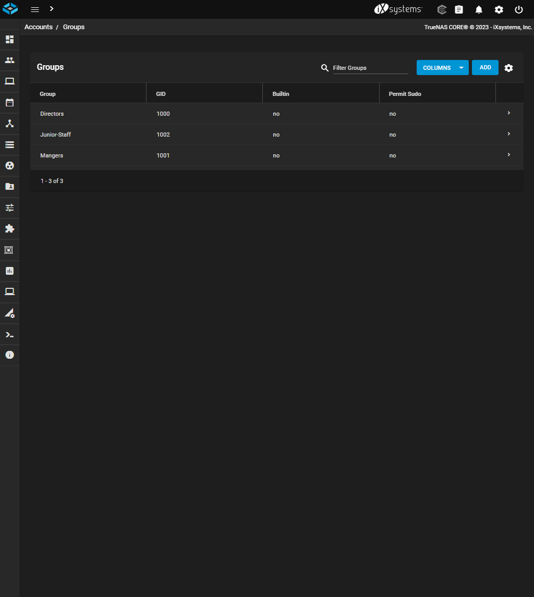

# <u>**Evidence of setting up the system**</u>

## <u>Desktops</u>

The desktops if the users.

## <u>Users</u>

The users setup on windows.

The user groups set up on the server.

## <u>Permissions</u>

The permission setup of the folders on the server.

## <u>Folders</u>

How the junior staff see the network share. The management folder is hidden and they will get a permission error if they try and write to the polices and procedures folder

How the mangers will see the network share. They can view all folders but will get an permissions error if they attempt to write in the polices and procedures folder or management folder

)

How the directors will see the network share. They can view all of the folders and can read from and write to all of them.

