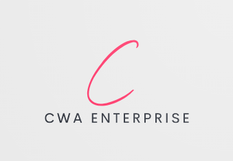

# <u>**Setup plan**</u>

## Workstations

### Desktops

The workstations desktops will have this company logo as their background.

On the desktops, there will be shortcuts to office 365 word and excel, the calculator app, file explorer and google chrome.

### Users

The workstations will be set up with 3 user (Junior staff, mangers and directors).

### Storage

The workstations will have a single drive installed in them. This will hold the os and software that has been installed. This will be mounted as the C: drive. The workstations will then have the server mapped as the D: drive. The employees wil be requested to save their work on the server and not on their local machines.

## Server

### Users

The server will be setup with 3 different user groups on it (Junior staff, mangers and directors).

### Folders

The server will be set up with 3 main folders on it. The first folder will be a general folder, this folder will be able to be fully accessed by all 3 groups. The second folder be a policies and procedures folder. This folder will have read only access by the junior staff and mangers but the directors will have full access. The last folder will be a management folder. The junior staff will not be able to access this folder in any way, the mangers will have read-only access and the directors will have full access.
